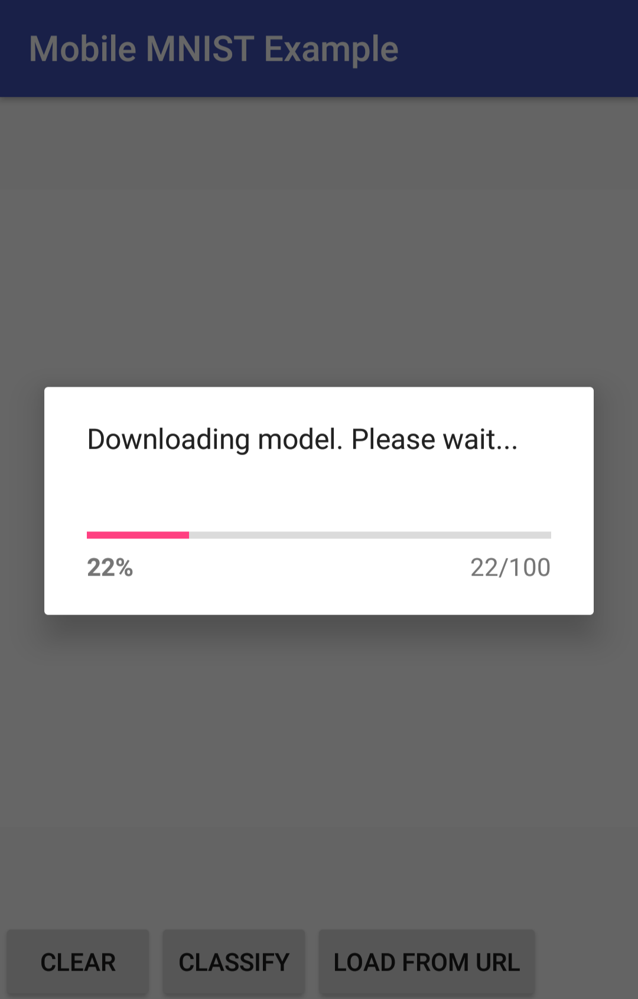
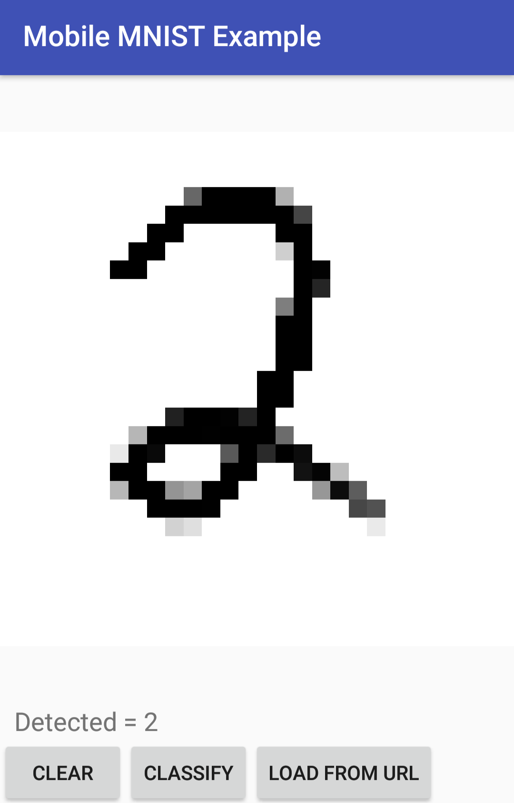

# Tutorial on Machine Learning for Intelligent Mobile User Interfaces using TensorFlow
One key feature of TensorFlow includes the possibility to compile the trained model to run efficiently on mobile phones. This enables a wide range of opportunities for researchers and developers. In this tutorial, we teach attendees two basic steps to run neural networks on a mobile phone: Firstly, we will teach how to develop neural network architectures and train them in TensorFlow. Secondly, we show the process to run the trained models on a mobile phone.

The compiled Android app to test the model trained in Step 1 is available in the [Android Store](https://play.google.com/store/apps/details?id=io.interactionlab.tutorial_mobile_example).

 

This tutorial will be/was held at:
* [MobileHCI'17, 4th September 2017, 11:15-13:15, Vienna, Austria](https://mobilehci.acm.org/2017/tutorials-about.html) - [Tutorial Website](https://interactionlab.io/imui-mobilehci17/)
* [Mensch und Computer 2017, 10th September 2017, 11:00-15:30, Regensburg, Germany](http://muc2017.mensch-und-computer.de/programm/tutorials-mci/)
* [MUM'17, 26th November 2017, 09:00-13:30, Stuttgart, Germany](http://www.mum-conf.org/2017/index.php?web=workshopsandtuts) - [Tutorial Website](https://interactionlab.io/imui-mum17/)
* [PerDis'18, 6th June 2018, 10:00-17:00, Munich, Germany](http://pervasivedisplays.org/2018/program.html) 
 
### Beyond the tutorial:
As a first step, we presented a classification example. Beyond that, we want to provide a regression example which also is a plug and play example:
https://github.com/interactionlab/Capacitive-Finger-Orientation-Estimation
